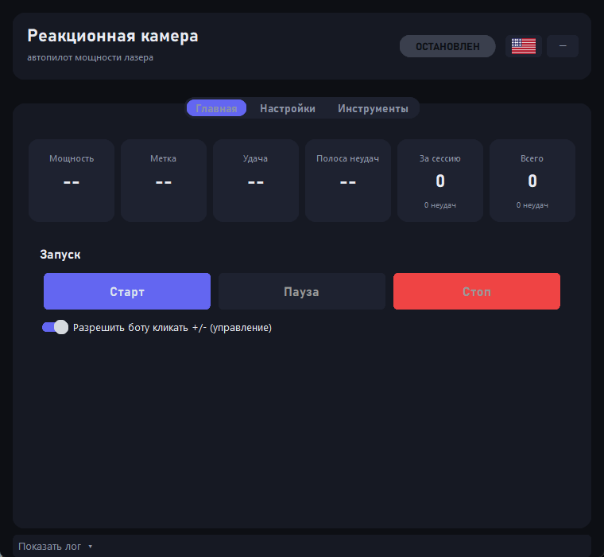
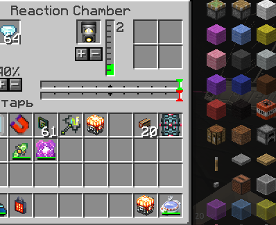
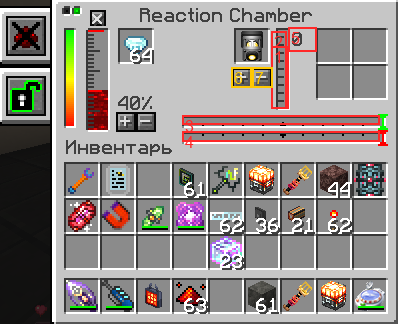

# TechgunChamber BotAuto

> Автоматический бот для **Реакционной камеры** (мод **Techguns**, Minecraft 1.7.10).
> Держит мощность лазера на нужном уровне во время крафта и сам возвращает её к базовой после завершения.



---

## Что умеет

- **Следит за меткой**: во время крафта красная метка случайно прыгает по шкале — бот подстраивает мощность кнопками `+`/`−`, чтобы шкала оставалась зелёной (иначе крафт не удастся).
- **Считает крафты**: ведёт статистику успешных/неудачных крафтов (за сессию и всего).
- **Цель**: можно задать «сделать N успешных крафтов» — бот сделает и остановится.
- **Сброс мощности**: после каждого крафта сам возвращает мощность к базовой (по умолчанию 3).
- **Стоп при неудаче**: если крафт не удался — останавливается и сигналит.
- **Уведомления**: баннер в окне + системный тост Windows + звук.
- **Трей**: сворачивается в трей; горячие клавиши `пауза` / `вкл-выкл контроль` / `выход` (переназначаются).
- **Язык**: русский / английский (переключается кнопкой-флагом).

## Как это работает

Бот **читает интерфейс камеры с экрана** (захват пикселей окна) и **кликает мышкой** по кнопкам `+`/`−`. Никаких модов/инжектов в саму игру не ставится — только наблюдение и клики.

Интерфейс реакционной камеры в игре:



Что именно читает бот (зоны):



| № | Зона | Зачем |
|---|------|-------|
| 1 | Шкала мощности | текущая мощность (заполнение) |
| 2 | Зона метки | поиск красной метки (цели) |
| 3 | Полоса удачи | зелёная — прогресс к успеху |
| 4 | Полоса неудачи | оранжевая — прогресс к провалу |
| 5 | Цифра мощности | точное значение мощности (0–10) |
| 6 | Кнопка `+` | увеличить мощность |
| 7 | Кнопка `−` | уменьшить мощность |

Мощность бывает **от 0 до 10**. Цифра распознаётся по шаблонам (0–9, «10» читается как «1»+«0»).

## Установка и запуск

1. Скачай архив из [релизов](../../releases) (или собери из исходников, см. ниже).
2. Распакуй **все файлы в одну папку** (`ChamberBot.exe`, `config.json`, `settings.json`, `digit_templates.json`, `app_icon.ico`, `panel_template.png`, `panel_template.json`).
3. Запусти `ChamberBot.exe`.
4. Открой Minecraft (оконный режим) и **открой GUI реакционной камеры**.

> Важно: окно бота **не должно перекрывать** кнопки `+`/`−` камеры, иначе клики не попадут. На время калибровки бот сам прячет своё окно.

## Калибровка (один раз при смене окна/масштаба)

Бот хранит **шаблон панели** (`panel_template.png`) — эталонный снимок камеры, под который подогнаны зоны. Если окно игры подвинули или изменили его размер, бот **сам заново находит панель по шаблону** (при любом GUI-масштабе) — зоны остаются на месте, ничего нажимать не нужно.

Во вкладке **Инструменты**:

1. **Найти окно и подогнать анкер** — находит панель автоматически по шаблону (без SPACE). Если шаблона нет или панель не нашлась — спросит два угла камеры (наведи курсор → `SPACE`).
2. **Ручная настройка зон** — самый надёжный способ: открывается снимок панели, на котором можно **перетаскивать прямоугольники зон и кнопки `+`/`−` мышкой** (тяни за квадратик в углу прямоугольника, чтобы изменить размер). Нажми «Сохранить».
3. **Запомнить шаблон панели** — сохрани текущую (идеально подогнанную) панель как эталон, чтобы автопоиск равнялся по ней. Жми после ручной подгонки зон.
4. **Калибровать кнопки +/−** — если клики мимо: наведи курсор на кнопку `+` в игре → `SPACE`, затем на `−` → `SPACE`.
5. **Калибровать цифры** — поставь мощность на известное значение, введи его; бот прокликает 0–9 и снимет шаблоны.
6. **Проверка калибровки** — показывает все зоны поверх игры, чтобы убедиться, что они на месте.

## Горячие клавиши

| Действие | По умолчанию |
|----------|--------------|
| Вкл/выкл контроль (клики) | `F8` |
| Пауза / продолжить | `F9` |
| Выход из бота | `F10` |

Переназначаются во вкладке **Настройки** → «Переназначить».

## Сборка из исходников

Требуется **Python 3.10+** и Windows.

```
pip install customtkinter pyinstaller pillow numpy opencv-python pystray winotify
pyinstaller --noconfirm --onefile --windowed --name ChamberBot ^
  --collect-all customtkinter --collect-all pystray ^
  --hidden-import cv2 --hidden-import numpy --hidden-import PIL --hidden-import winotify gui.py
```
(или просто запусти `build.bat` — он сам скопирует данные в `dist\`). Вручную: скопируй `config.json`, `settings.json`, `digit_templates.json`, `app_icon.ico`, `panel_template.png`, `panel_template.json` из корня в `dist\` рядом с exe.

Проверка логики без игры: `python selftest.py`.

## Структура проекта

| Файл | Назначение |
|------|-----------|
| `gui.py` | графический интерфейс (вкладки, настройки, лог) |
| `engine.py` | запуск бота в фоновом потоке, очередь событий |
| `chamber_bot.py` | основная логика: чтение состояния, регулятор мощности, счёт крафтов |
| `vision.py` | захват экрана, чтение шкал/полос/метки |
| `digit.py` | распознавание цифры мощности по шаблонам |
| `mouse.py` | клики мышью и хоткеи |
| `window.py` | поиск окна, фокус, координаты |
| `panel_match.py` | поиск панели по сохранённому шаблону (автоподгонка анкера при любом размере окна) |
| `find_anchor.py` | переопределение анкера вручную (шаблон → запасной поиск по серому) |
| `calibrate_digits.py` | калибровка шаблонов цифр |
| `i18n.py` | строки RU/EN |
| `settings.py` / `config.json` | настройки и калибровки |

---

# TechgunChamber BotAuto (English)

> An automation bot for the **Reaction Chamber** (**Techguns** mod, Minecraft 1.7.10).
> It keeps the laser power at the right level during crafting and resets it to the base value afterwards.

## Features

- **Tracks the marker**: during a craft the red marker jumps around the scale; the bot clicks `+`/`−` to keep the power matched (otherwise the craft fails).
- **Counts crafts**: success/failure statistics (per session and total).
- **Target**: set “make N successful crafts” — the bot does it and stops.
- **Power reset**: returns power to the base level (default 3) after each craft.
- **Stop on failure**: stops and alerts if a craft fails.
- **Notifications**: in-app banner + Windows toast + sound.
- **System tray**; hotkeys for pause / toggle control / quit (rebindable).
- **Language**: Russian / English.

## How it works

The bot **reads the chamber UI from the screen** (pixel capture of the window) and **clicks** the `+`/`−` buttons. No mods or injections are installed into the game — pure observation and clicks. Power ranges from **0 to 10**; the digit is recognized via templates.

| Bot GUI | Chamber UI in game | Zones the bot reads |
|---|---|---|
|  |  |  |

## Install & run

1. Download the archive from [Releases](../../releases) (or build from source).
2. Extract **all files into one folder**.
3. Run `ChamberBot.exe`.
4. Open Minecraft (windowed mode) and open the **Reaction Chamber GUI**.

> The bot window must **not cover** the chamber `+`/`−` buttons. During calibration the bot hides its own window automatically.

## Calibration (once, after moving/resizing the game window)

The bot keeps a **panel template** (`panel_template.png`) — a reference snapshot of the chamber the zones were fitted to. When the game window is moved or resized, the bot **re-finds the panel by template automatically** (at any GUI scale), so the zones stay in place and you don't have to press anything.

In the **Tools** tab: **Find window & fit anchor** (locates the panel from the template automatically, no SPACE needed; falls back to two-corner manual mode when there is no template); **Adjust zones manually** (most reliable — drag the zone rectangles and +/- buttons with the mouse, then Save); **Save panel template** (store the current perfectly-fitted panel as the reference — do this after manual adjustments); **Calibrate +/− buttons**; **Calibrate digits**; and **Verify calibration** to see all zones overlaid on the game.

## Hotkeys

Toggle control `F8`, Pause `F9`, Quit `F10` (rebindable in Settings).

## Building from source

Requires **Python 3.10+** on Windows. Install deps and run PyInstaller (see `build.bat`):
```
pip install customtkinter pyinstaller pillow numpy opencv-python pystray winotify
build.bat
```
Then copy `config.json`, `settings.json`, `digit_templates.json`, `app_icon.ico`, `panel_template.png`, `panel_template.json` next to the produced exe (`build.bat` does this for you). Run `python selftest.py` to test the logic without the game.

---

*Проект предоставлен «как есть». / Provided as-is.*
